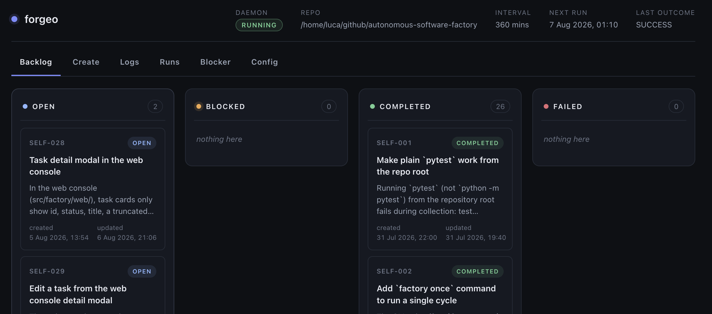

# Getting Started

This guide installs the `factory` CLI, initializes a config, and runs your
first backlog task.

## 1. Install

Install the `factory` CLI from the public GitHub remote with the one-liner
(**no Python required**):

```bash
curl -fsSL https://forgeo.org/install.sh | bash
```

The installer:

- downloads a prebuilt standalone binary from the matching GitHub Release
  for your OS/arch (Linux, macOS, and Windows) into `~/.local/bin`;
- falls back to `pipx` and then `pip install --user` only when no prebuilt
  binary matches your platform and a Python 3.11+ is available;
- never needs root;
- re-running it upgrades the existing install (re-downloads /
  `pipx --force` / `pip --upgrade`).

If the install location is not on your `PATH`, it warns you and tells you how
to add it.

## 2. Initialize

Run the guided wizard from your project root:

```bash
factory init
```

The wizard asks for three things:

1. **Factory folder** — where the backlog, `BLOCKER.md` and the log live
   (default `.factory`). It is gitignored by default.
2. **Coding agent command** — any shell command that reads `$FACTORY_TASK` and
   works in the repository (default `aider --message "$FACTORY_TASK"`).
3. **Refactor prompt** — the instruction used when the backlog is empty; the
   default is offered, or you can paste a custom one.

`factory init` writes `factory.yaml`, creates the factory folder, and appends
`<folder>/` to `.gitignore` (unless you opt out).

```bash
factory init --force    # overwrite an existing factory.yaml
```

## 3. Create your first backlog

The backlog is a plain JSON file (see [Backlog format](backlog.md)). Create
the file configured as `backlog:` in your `factory.yaml` — by default
`.factory/backlog.json`. Once the factory is running you can also add tasks
from the [web console](web-console-api.md) — no file editing needed:

```json
{
  "tasks": [
    {
      "id": "TASK-001",
      "title": "Implement fibonacci module",
      "description": "Write a fibonacci module with memoization and tests.",
      "status": "OPEN",
      "created_at": "2026-07-31T10:00:00Z"
    }
  ]
}
```

!!! tip

    Hand this spec to your favorite LLM to generate the initial backlog for
    the application you want to build.

## 4. Start the factory

```bash
factory start
```

The daemon wakes up every `interval_minutes` and runs one cycle. It runs in
the foreground — interrupt it with Ctrl-C, or stop it from another terminal
with `factory stop`. A local web dashboard is served at
<http://127.0.0.1:8787> (see [Web console & HTTP API](web-console-api.md)):



## 5. Verify

```bash
factory status
```

shows the config, backlog counts, the next `OPEN` task, whether the daemon is
running, and the last run outcome. To run exactly one cycle without leaving a
daemon up:

```bash
factory once
```

## 6. Multiple repositories / instances

The factory runs one config per repository — nothing stops you from running
several factories on several repositories at the same time. Each config gets
its own backlog, logs, locks and `runs.jsonl`, and each daemon is a separate
process, so instances are fully independent. The **instance registry** gives
every factory a stable name so you can enumerate them and manage them from
anywhere.

```bash
# 1. Initialize a config per repository (run the wizard in each project root)
factory init

# 2. Start a daemon per instance; each config is registered automatically
#    under its `name` on first start (or pre-register with `instance add`)
factory start --config /path/to/site-a/factory.yaml
factory start --config /path/to/site-b/factory.yaml

# 3. List every registered instance (also: `factory list`)
factory instance list

# 4. From anywhere, target an instance by name
factory start --name site-a
factory stop --name site-a

# 5. Open the central dashboard: one page for every registered instance
factory web           # default http://0.0.0.0:8790
```

`--name` works on `start`, `once`, `status`, `stop` and `restart` and is
mutually exclusive with `--config`; an unknown name prints a clear error.
`start` and `stop` with `--config` register the factory automatically under
its config's `name` when it is not in the registry yet, so the registry stays
in sync without manual `factory instance add` steps.
When the embedded per-daemon dashboard is used, give each `factory.yaml` a
distinct `web_port` (they all default to `8787`) — the central `factory web`
dashboard avoids the conflict entirely. See [Configuration](configuration.md)
for the registry file, and [CLI reference](cli-reference.md) for the commands.

## Next steps

- [Configuration reference](configuration.md) — every `factory.yaml` key.
- [Backlog format](backlog.md) — task schema and statuses.
- [Agent contract](agent-contract.md) — how the agent is invoked.
- [CLI reference](cli-reference.md) — all commands.
